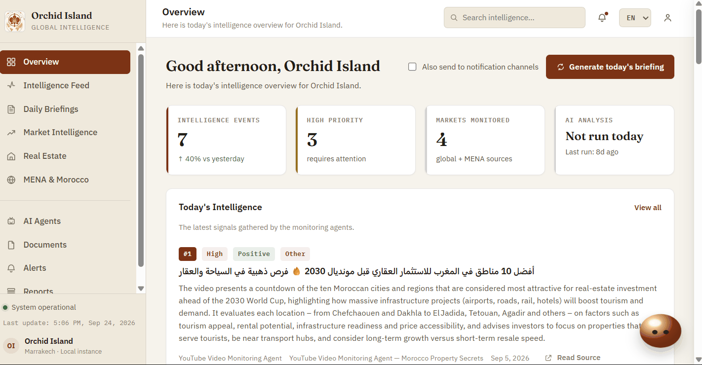

<div align="center">

# Global Monitoring & Real Estate Intelligence System

**Real-time market intelligence for Orchid Island, Marrakech** — six AI agents watch the news,
argue about what it means, and turn it into sourced, actionable calls.

[](https://www.python.org/)
[](https://fastapi.tiangolo.com/)
[](https://www.langchain.com/langgraph)
[](#real-llm-two-voice-debate)
[](#code-quality)
[](#no-mock-mode)

</div>

<br>

<p align="center">
  
</p>

<p align="center"><em>The console: today's intelligence overview, per-event detail, daily briefings, and live configuration status — all running against real data, nothing staged for the screenshot.</em></p>

<br>

## What this is

Six independent agents monitor political, economic, regional (MENA/Morocco), expert-commentary,
real-estate-sector, and YouTube video news in real time. Every event they surface is cross-examined
by a second, independently configured model before it's trusted, scored for business impact against
a knowledge base of Orchid Island's own market context, and delivered as a daily briefing by
WhatsApp, Telegram, and email.

Nothing here is simulated. Every required credential is checked before use; a missing one raises a
clear error naming exactly what's needed, rather than quietly running on placeholder data.

<br>

## Contents

- [Why it's built this way](#why-its-built-this-way)
- [Real LLM, two-voice debate](#real-llm-two-voice-debate)
- [No mock mode](#no-mock-mode)
- [Architecture](#architecture)
- [Getting started](#getting-started)
- [Configuration](#configuration)
- [Local console](#local-console)
- [Daily notifications](#daily-notifications)
- [Knowledge base](#knowledge-base)
- [Code quality](#code-quality)
- [Known limitations](#known-limitations)

<br>

## Why it's built this way

| | |
|---|---|
| 🛰️ **Six monitoring agents** | Political, economic, expert commentary, regional MENA/Morocco, real estate sector, and YouTube video — each running real web search against a curated, configurable list of outlets, in parallel. |
| ⚖️ **Two-voice adversarial debate** | Every event is reviewed by a primary LLM (`Defender`) and a second, independently configured provider (`Challenger`), in a bounded, at most three-round exchange — so the review never shares one model's blind spots. |
| 🧭 **Judge agent** | Turns each event and its debate outcome into a sourced impact assessment: sector, direction, magnitude, confidence, time horizon, and a recommended action — grounded in a retrieval-augmented knowledge base, not a bare opinion. |
| 📄 **Document intelligence** | Upload PDFs for analysis, including genuine scans with no text layer — real OCR (PyMuPDF + Tesseract) reads them, touching only the pages that actually need it. |
| 🔔 **Daily delivery** | WhatsApp, Telegram, and email digests, each optional and independently configured, honestly reported as skipped if credentials are missing — never a silent failure. |
| 🖥️ **A real console** | FastAPI + plain HTML/CSS/JS, in English, French, and Arabic. No build step, no separate frontend server, nothing hosted outside the machine it runs on. |

<br>

## Real LLM, two-voice debate

`LLM_PROVIDER` (Gemini by default, Anthropic also wired) drives every monitoring agent and acts as
the debate's **Defender** — the voice representing what the agents actually found. A second,
independently configured provider via `GROQ_API_KEY` acts as the **Challenger**, whose only job is
to look for reasons an event might be overstated, under-sourced, or open to another reading.

**Round 1** — Challenger reviews every event and flags specific objections (none found, resolved
immediately). **Round 2** — Defender responds: concede and revise, or defend. **Round 3** (final,
bounded) — Challenger makes the last call: resolved, contested, or uncertain. Nothing is ever
silently dropped.

<br>

## No mock mode

Every required credential (`LLM_API_KEY`, `GROQ_API_KEY`, `WEB_SEARCH_API_KEY`) is checked at the
point it's needed. Missing one raises `MissingConfigurationError`, naming exactly which `.env`
variable to set — it never silently substitutes a fixture or a keyword heuristic. A real call that
fails (a rate limit, a network blip) is reported honestly as a failed or skipped step, visible in
the per-run trace, never papered over.

> The automated test suite is the one place this differs: `pytest` runs fully offline, with
> dependency injection at the test boundary only (`tests/conftest.py`). The running application
> always calls the real services, or raises.

<br>

## Architecture

```
global-monitoring-real-estate-intelligence/
├── src/
│   ├── models/          # Event, DebateLog, ImpactAssessment, DailyReport, PipelineState
│   ├── tools/            # web_search, fetch_page, extract_content, pdf_extraction (+ OCR), calculator, YouTube search/transcript
│   ├── services/         # llm_client, knowledge_base (RAG), run_store, run_persistence, pdf_export,
│   │                      # document_store, chat_assistant, source_classification, translation,
│   │                      # whatsapp_notifier, telegram_notifier, email_notifier
│   ├── agents/           # monitoring_agent (6 configured instances), debate_agent, judge_agent, document_agent
│   ├── orchestrator/     # LangGraph graph: fan-out -> collect -> debate -> judge -> format_report
│   ├── api/
│   │   ├── main.py       # FastAPI app -- see "Local console" below for the route list
│   │   └── static/       # the local console: plain HTML/CSS/JS, no build step, EN/FR/AR
│   ├── config/           # settings.py -- .env loading, settings.require(...)
│   └── errors.py         # MissingConfigurationError
├── tests/                # 289 tests, all pass offline via test-level monkeypatching
├── knowledge_base/       # general market/tourism/macro reference material used by the RAG judge
├── scripts/
│   ├── demo_run.py       # runnable end-to-end demo, with an upfront config check
│   └── daily_notify.py   # standalone daily job: run pipeline, persist, attempt WhatsApp + Telegram + email, always exit 0
├── requirements.txt
├── .env.example
└── .gitignore
```

<br>

## Getting started

```bash
pip install -r requirements.txt
cp .env.example .env        # fill in real credentials -- see that file for where to get each one

pytest                      # 289 tests, run fully offline

uvicorn src.api.main:app --reload --port 8000
# open http://localhost:8000 for the local console, or:
curl -X POST http://localhost:8000/run-digest
```

`scripts/demo_run.py` prints an upfront configuration check (which credentials are actually set)
before running anything, so a missing one is obvious immediately rather than surfacing as a
confusing failure partway through.

<br>

## Configuration

All configuration lives in `.env` (copy `.env.example` to start).

**Required:**

- `LLM_API_KEY` / `LLM_PROVIDER` — the primary model (Gemini by default; Anthropic also wired).
- `GROQ_API_KEY` — the independent second voice used by the debate stage.
- `WEB_SEARCH_API_KEY` — the web search / news provider.

**Optional**, each independently configured and honestly skipped if left blank:

- `YOUTUBE_API_KEY` — for the YouTube Video Monitoring Agent.
- `OCR_ENABLED`, `TESSERACT_CMD`, `OCR_LANGUAGES`, `OCR_MAX_PAGES`, `OCR_DPI` — OCR for scanned PDF
  uploads (see `.env.example` for install steps per OS).
- WhatsApp, Telegram, and email notification settings (see [Daily notifications](#daily-notifications)).

See `.env.example` for the full, commented list, including exactly where to obtain each key.

<br>

## Local console

`uvicorn src.api.main:app --reload --port 8000`, then open `http://localhost:8000`. One process,
no separate frontend server, no build step.

<details>
<summary><strong>Main routes</strong></summary>
<br>

| Route | What it does |
|---|---|
| `GET /health` | Which required credentials are actually configured. |
| `POST /run-digest` · `POST /run-digest-and-notify` | Run the real pipeline, optionally followed by a real notification attempt. |
| `GET /runs` · `GET /runs/{id}` · `GET /runs/{id}/pdf` | Run history and PDF export. |
| `POST /documents/upload` · `GET /documents` · `GET /documents/{id}` · `GET /documents/{id}/pdf` · `DELETE /documents/{id}` | The document library — multi-file upload, folder upload, OCR for scans. |
| `POST /notify/test` · `GET /notify/status` | Verify notification credentials without running the full pipeline. |
| `POST /chat` | The in-console assistant. |
| `PUT /runs/{run_id}/events/{event_id}/note` | Per-event notes, saved onto that run's own record. |

</details>

Every run is saved and indexed (`src/services/run_store.py`, a small SQLite index over the run
history), so past runs stay browsable, not just the latest one.

<br>

## Daily notifications

Three independent, optional channels, each honestly reported as skipped if its credentials aren't set:

- **WhatsApp** via callmebot.com (free, personal use, one-time opt-in) or Twilio.
- **Telegram** via a bot created through `@BotFather`.
- **Email** via plain SMTP (Gmail, Office 365, or any SMTP relay) — the channel that carries the
  full PDF report as an attachment.

See `.env.example` for exact setup steps. Once configured, `scripts/daily_notify.py` is meant to be
triggered once a day by an OS-level scheduler (there's no built-in scheduler in the app itself) —
Task Scheduler on Windows, `cron` or a `launchd`/`systemd` timer elsewhere.

<br>

## Knowledge base

`src/services/knowledge_base.py` implements lexical (BM25 keyword) retrieval over `knowledge_base/`,
used by the judge agent to ground its impact assessments. No embeddings or vector database — none
are needed at this corpus size. The files here are general market, tourism, and macroeconomic
reference material; company-specific confidential records (land parcels, specific listings,
investment-opportunity dossiers) are kept out of this public repository.

<br>

## Code quality

289 tests, all passing, run fully offline through dependency injection at the test boundary only —
the running application always calls real services or raises a clear configuration error. See
[No mock mode](#no-mock-mode) for what that distinction actually means.

Adding a new monitoring source is one config entry in `MONITORING_AGENTS`
(`src/agents/monitoring_agent.py`) for a source that fits an existing `source_type` (`web` or
`youtube`); a genuinely new retrieval pipeline means adding a new `source_type` branch inside
`run_monitoring_agent()`, the same way the YouTube branch was added.

<br>

## Known limitations

- **Free-tier LLM rate limiting.** A single run can make 15–20+ model calls in quick succession;
  on a free-tier key this can hit a rate limit partway through. Affected items are skipped or
  recorded as a failed step with the real error, never silently filled in.
- **Generic source list.** The curated outlet list in `monitoring_agent.py` is a starting point,
  straightforward to extend per outlet.
- **Distribution/dashboard phase** is not yet built.
- **Social platforms.** TikTok's Research API excludes commercial users and Instagram's official
  API only covers your own business account, so neither is wired in; the only alternative would be
  scraping, which risks violating those platforms' terms of service.

<br>

<div align="center">

---

Built for Orchid Island, Marrakech. Proprietary — internal project, not published under an open-source license.

</div>
